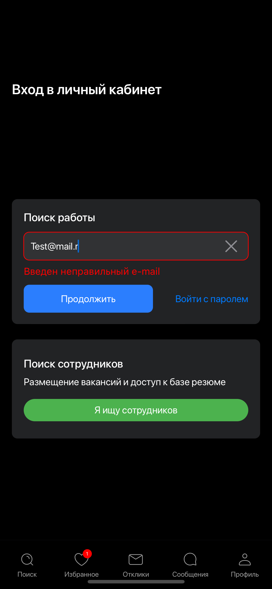
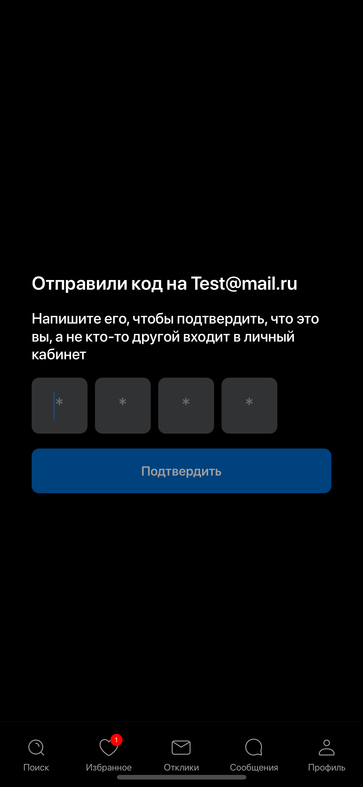
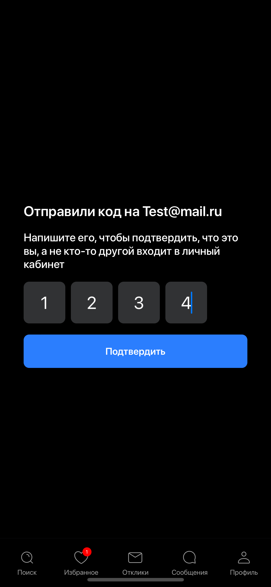
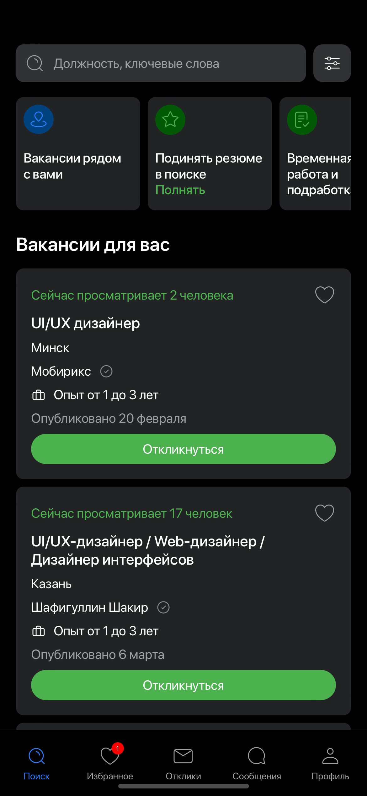
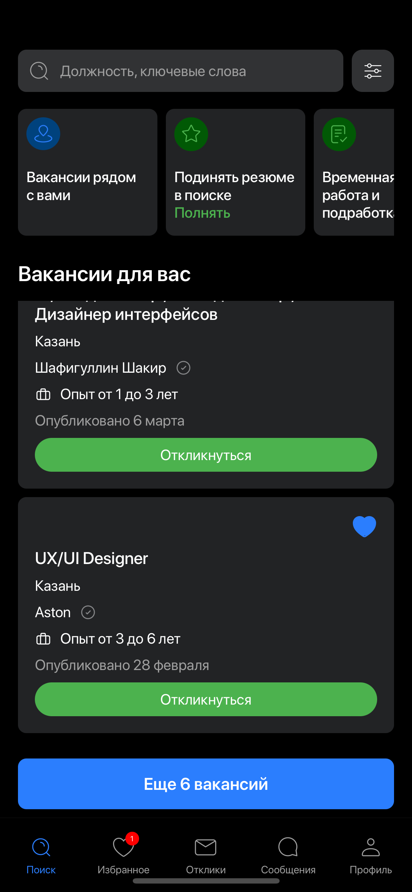
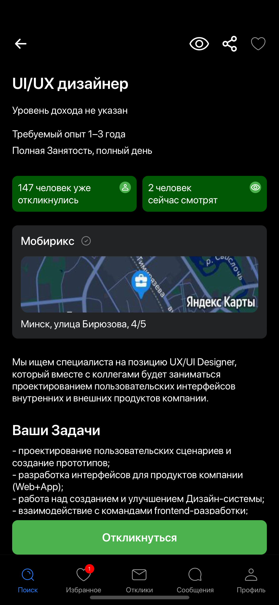
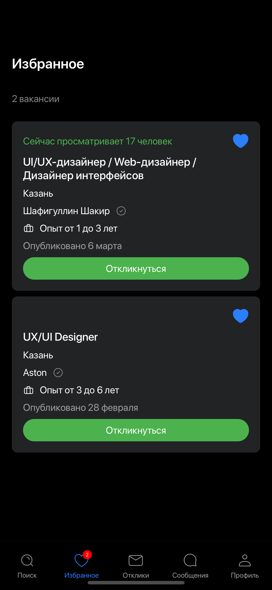

Тестовое Задание 
# Job Search Application

Тестовое задание на позицию IOS-разработчика в компанию EffectiveMobile

# Использованный стэк технологий:
- Swift5, Xcode
- SwiftUI
- MVVM + Coordinator
- Ui, дизайн, верстка - Figma
- Вакансии и данные - JSON

# Запуск приложения
## - Через Xcode (Canvas)
- Открыть файл .xcodeproj
- Отобразить canvas через "CoordinatorView"
## - Через Simulator

# Реализованные возможности(согласно ТЗ) и скриншоты
## Экран логина

  
  

## Экран авторизации по коду

  
  

## Экран "Поиска" с отображением превью вакансий

  
  

## Экран "Детального просмотра" с отображением полной информации вакансий

  

## Экран "Избранное" с лайкнутыми вакансиями

  

